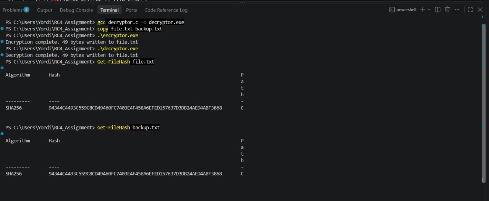

# RC4 File Encryptor & Decryptor

A simple C implementation of the RC4 stream cipher that encrypts and decrypts the contents of `file.txt` in place.

## Files

- `encryptor.c` — reads `file.txt`, encrypts it with RC4, writes the ciphertext back to `file.txt`
- `decryptor.c` — reads `file.txt`, decrypts it with RC4 using the same key, restores the original contents

## How RC4 Works Here

1. **KSA (Key Scheduling Algorithm)** — initializes a 256-byte array using the key, producing a key-dependent permutation.
2. **PRGA (Pseudo-Random Generation Algorithm)** — generates a pseudorandom keystream byte-by-byte from that permutation.
3. **XOR** — each plaintext/ciphertext byte is XORed with a keystream byte. Since `A XOR B XOR B = A`, applying the same keystream twice (once to encrypt, once to decrypt) recovers the original data exactly.

## Build

```bash
gcc encryptor.c -o encryptor.exe
gcc decryptor.c -o decryptor.exe
```

## Run

```bash
.\encryptor.exe   # encrypts file.txt in place
.\decryptor.exe   # decrypts file.txt back to its original contents
```

## Verification

To confirm the decrypted file is byte-for-byte identical to the original:

```powershell
copy file.txt backup.txt
.\encryptor.exe
.\decryptor.exe
Get-FileHash file.txt
Get-FileHash backup.txt
```

Matching SHA256 hashes confirm the round trip is lossless.



## Notes

- Files are opened in binary mode (`"rb"`/`"wb"`) to avoid Windows text-mode newline translation from corrupting encrypted bytes.
- The RC4 key is defined via the `KEY` macro at the top of each file and must match exactly between `encryptor.c` and `decryptor.c`.
- This project is scoped strictly to the provided `file.txt` test file for a controlled cryptography exercise.